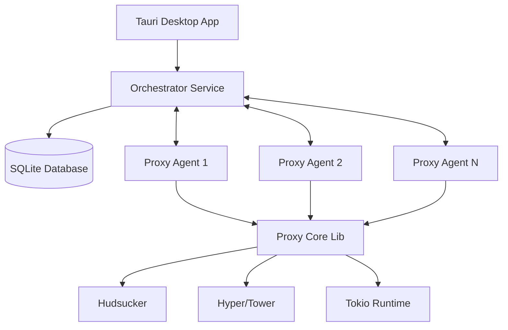

# Design Document: Distributed MITM Proxy

## Overview

The Distributed MITM Proxy is a Rust-based system that enables intercepting, analyzing, and modifying HTTP/HTTPS traffic across multiple proxy agents. The system consists of four main components organized as a Cargo workspace: a shared core library, standalone proxy agents, a central orchestrator service, and a desktop UI application built with Tauri.

## Architecture

The system follows a distributed architecture with the following components:



### Component Relationships

- **Tauri App** communicates with the **Orchestrator** to provide UI functionality
- **Orchestrator** manages multiple **Proxy Agents** via gRPC communication
- **Proxy Agents** use the **Proxy Core** library for actual traffic interception
- **Orchestrator** stores data and configuration in **SQLite Database**

## gRPC Protocol Layer

The system uses Protocol Buffers (protobuf) and gRPC for communication between proxy agents and the orchestrator. The protocol is defined in `proto/proxy.proto` and compiled using `tonic-build`.

### Protocol Definition (`proxy.proto`)

```protobuf
syntax = "proto3";

package proxy;

// HTTP headers representation
message HttpHeaders {
  map<string, string> headers = 1;
}

// HTTP request data structure
message HttpRequestData {
  string method = 1;        // GET, POST, etc.
  string url = 2;           // Full URL
  HttpHeaders headers = 3;  // Request headers
  bytes body = 4;           // Request body
}

// HTTP response data structure
message HttpResponseData {
  int32 status_code = 1;    // HTTP status code
  HttpHeaders headers = 2;  // Response headers
  bytes body = 3;           // Response body
}

// Traffic event - can be either request or response
message TrafficEvent {
  string request_id = 1;    // UUID for tracking requests
  oneof event {
    HttpRequestData request = 2;
    HttpResponseData response = 3;
  }
}

// Command from orchestrator to agent (placeholder for future features)
message InterceptCommand {
  // Future: modify, block, redirect commands
}

// gRPC service definition
service ProxyService {
  // Bidirectional streaming for real-time traffic data
  rpc StreamTraffic(stream TrafficEvent) returns (stream InterceptCommand);
}
```

### Build Configuration

The protocol is compiled using `tonic-build` in the `build.rs` file of the `proxy-core` crate, making the generated types available to both `proxy-agent` and `orchestrator` crates.

## Components and Interfaces

### 1. Proxy Core Library (`proxy-core`)

**Purpose**: Shared library containing core proxy functionality, HTTP/HTTPS interception logic, and gRPC protocol definitions.

**Key Responsibilities**:
- HTTP/HTTPS traffic interception using Hudsucker
- Certificate Authority (CA) management with Rcgen
- Request/response processing and modification
- gRPC protocol definitions and generated types
- Async networking with Hyper and Tower

**Module Structure**:
```rust
// Certificate Authority management
pub mod ca {
    pub struct CertificateAuthority {
        // CA certificate and private key
    }
    
    impl CertificateAuthority {
        pub fn new() -> Result<Self, ProxyError>;
        pub fn gen_cert_for_domain(&self, domain: &str) -> Result<Certificate, ProxyError>;
    }
}

// HTTP traffic handlers
pub mod handlers {
    pub struct LogHandler {
        // Handler state
    }
    
    impl hudsucker::HttpHandler for LogHandler {
        async fn handle_request(&mut self, req: Request<Body>) -> Result<Request<Body>, ProxyError>;
        async fn handle_response(&mut self, res: Response<Body>) -> Result<Response<Body>, ProxyError>;
    }
}

// Main proxy server
pub struct ProxyServer {
    port: u16,
    ca: CertificateAuthority,
}

impl ProxyServer {
    pub fn new(port: u16) -> Result<Self, ProxyError>;
    pub async fn run(&self) -> Result<(), ProxyError>;
}

// Generated gRPC types (from proto compilation)
pub mod proto {
    pub use crate::generated::proxy::*;
}
```

**Certificate Authority Management**:
- Automatically loads existing CA certificates from disk (`ca.pem`, `ca.key`)
- Generates new Root CA if certificates don't exist
- Dynamically generates domain-specific certificates for HTTPS interception
- Persistent storage for reuse across sessions

**Traffic Interception**:
- Implements `hudsucker::HttpHandler` for request/response processing
- Safely handles HTTP body reading without breaking the stream
- Logs all intercepted traffic with unique request IDs
- Preserves original request/response integrity

### 2. Proxy Agent Binary (`proxy-agent`)

**Purpose**: Standalone executable that runs on servers to intercept network traffic.

**Key Responsibilities**:
- Run as a standalone server process
- Communicate with the orchestrator via gRPC
- Use proxy-core for actual traffic handling
- Report status and metrics to orchestrator

**Configuration**:
- Listening port and interface
- Orchestrator connection details
- Proxy behavior settings

### 3. Orchestrator Library (`orchestrator`)

**Purpose**: Central coordination service managing proxy agents and data storage.

**Key Responsibilities**:
- gRPC server for agent communication
- SQLite database operations for data persistence
- Agent registration and health monitoring
- Configuration distribution to agents

**Public Interface**:
```rust
// gRPC service definitions
pub struct OrchestratorService {
    db: SqlitePool,
}

impl OrchestratorService {
    pub async fn register_agent(&self, req: RegisterAgentRequest) -> Result<RegisterAgentResponse, Status>;
    pub async fn report_metrics(&self, req: MetricsRequest) -> Result<MetricsResponse, Status>;
    pub async fn get_configuration(&self, req: ConfigRequest) -> Result<ConfigResponse, Status>;
}

// Database operations
pub struct DatabaseManager {
    pool: SqlitePool,
}

impl DatabaseManager {
    pub async fn new(database_url: &str) -> Result<Self, sqlx::Error>;
    pub async fn store_traffic_data(&self, data: TrafficData) -> Result<(), sqlx::Error>;
    pub async fn get_agent_status(&self, agent_id: &str) -> Result<AgentStatus, sqlx::Error>;
}
```

### 4. Tauri Desktop Application (`tauri-app`)

**Purpose**: Desktop UI for managing the distributed proxy system.

**Key Responsibilities**:
- Provide user interface for system management
- Display real-time traffic data and metrics
- Configure proxy agents and rules
- Communicate with orchestrator service

**UI Components**:
- Agent management dashboard
- Traffic monitoring and analysis
- Configuration management
- Real-time metrics display

## Data Models

### Agent Registration
```rust
#[derive(Serialize, Deserialize)]
pub struct AgentInfo {
    pub id: String,
    pub address: String,
    pub port: u16,
    pub status: AgentStatus,
    pub last_heartbeat: DateTime<Utc>,
}
```

### Traffic Data
```rust
#[derive(Serialize, Deserialize)]
pub struct TrafficData {
    pub id: String,
    pub agent_id: String,
    pub request: HttpRequest,
    pub response: Option<HttpResponse>,
    pub timestamp: DateTime<Utc>,
    pub processing_time: Duration,
}
```

## System Metrics Monitoring

### Overview

The system includes comprehensive resource monitoring capabilities using gRPC streaming to efficiently transmit CPU, memory, network, and disk usage metrics from proxy agents to the orchestrator. This approach leverages the existing gRPC infrastructure for consistent, high-performance metrics collection.

### gRPC-Based Metrics Architecture

```rust
// System metrics collection and gRPC streaming
pub mod system_metrics {
    use sysinfo::{System, SystemExt, CpuExt, NetworkExt, DiskExt};
    use crate::pb::{SystemMetricsEvent, SystemMetrics, NetworkMetrics, DiskMetrics, ProcessMetrics};
    use std::time::{Duration, SystemTime, UNIX_EPOCH};
    use tokio::time::interval;
    
    pub struct SystemMetricsCollector {
        system: System,
        agent_id: String,
        collection_interval: Duration,
    }
    
    impl SystemMetricsCollector {
        pub async fn start_streaming(
            &mut self,
            mut metrics_stream: tonic::Streaming<crate::pb::MetricsCommand>
        ) -> Result<(), Box<dyn std::error::Error>> {
            let mut interval = interval(self.collection_interval);
            
            loop {
                tokio::select! {
                    _ = interval.tick() => {
                        let metrics_event = self.collect_metrics().await?;
                        // Send via gRPC stream
                        self.send_metrics(metrics_event).await?;
                    }
                    
                    command = metrics_stream.message() => {
                        if let Some(cmd) = command? {
                            self.handle_metrics_command(cmd).await?;
                        }
                    }
                }
            }
        }
        
        async fn collect_metrics(&mut self) -> Result<SystemMetricsEvent, Box<dyn std::error::Error>> {
            self.system.refresh_all();
            
            let timestamp = SystemTime::now()
                .duration_since(UNIX_EPOCH)?
                .as_secs() as i64;
            
            let metrics = SystemMetrics {
                cpu_usage_percent: self.system.global_cpu_info().cpu_usage(),
                memory_used_bytes: self.system.used_memory(),
                memory_total_bytes: self.system.total_memory(),
                network: Some(self.collect_network_metrics()),
                disk: Some(self.collect_disk_metrics()),
                process: Some(self.collect_process_metrics()),
            };
            
            Ok(SystemMetricsEvent {
                agent_id: self.agent_id.clone(),
                timestamp,
                metrics: Some(metrics),
            })
        }
    }
}
```

### gRPC Service Integration

The orchestrator's gRPC service is extended to handle metrics streaming:

```rust
// Extended ProxyService implementation
impl ProxyService for OrchestratorService {
    // Existing methods...
    
    async fn stream_metrics(
        &self,
        request: Request<tonic::Streaming<SystemMetricsEvent>>,
    ) -> Result<Response<Self::StreamMetricsStream>, Status> {
        let mut metrics_stream = request.into_inner();
        let (tx, rx) = mpsc::channel(100);
        
        // Spawn task to handle incoming metrics
        let db = self.db.clone();
        let metrics_broadcaster = self.metrics_broadcaster.clone();
        
        tokio::spawn(async move {
            while let Some(metrics_event) = metrics_stream.message().await? {
                // Store in database
                db.store_system_metrics(&metrics_event).await?;
                
                // Broadcast to UI subscribers
                metrics_broadcaster.send(metrics_event.clone())?;
                
                // Send configuration updates if needed
                if let Some(config) = check_metrics_config_update(&metrics_event).await {
                    tx.send(Ok(MetricsCommand {
                        command: Some(metrics_command::Command::Config(config))
                    })).await?;
                }
            }
            Ok::<(), Box<dyn std::error::Error>>(())
        });
        
        Ok(Response::new(ReceiverStream::new(rx)))
    }
}
```

### Database Schema for Metrics

```sql
-- System metrics storage
CREATE TABLE system_metrics (
    id INTEGER PRIMARY KEY AUTOINCREMENT,
    agent_id TEXT NOT NULL,
    timestamp INTEGER NOT NULL,
    cpu_usage_percent REAL NOT NULL,
    memory_used_bytes INTEGER NOT NULL,
    memory_total_bytes INTEGER NOT NULL,
    network_rx_bytes INTEGER NOT NULL,
    network_tx_bytes INTEGER NOT NULL,
    disk_read_bytes INTEGER NOT NULL,
    disk_write_bytes INTEGER NOT NULL,
    process_cpu_percent REAL NOT NULL,
    process_memory_bytes INTEGER NOT NULL,
    process_uptime_seconds INTEGER NOT NULL,
    created_at INTEGER DEFAULT (strftime('%s', 'now'))
);

CREATE INDEX idx_system_metrics_agent_timestamp ON system_metrics(agent_id, timestamp);
CREATE INDEX idx_system_metrics_timestamp ON system_metrics(timestamp);
```

### Agent-Side Implementation

```rust
// In proxy-agent/src/main.rs
async fn start_metrics_streaming(
    agent_id: String,
    mut grpc_client: ProxyServiceClient<Channel>
) -> Result<(), Box<dyn std::error::Error>> {
    let mut metrics_collector = SystemMetricsCollector::new(
        agent_id,
        Duration::from_secs(5) // Default 5-second interval
    );
    
    // Create bidirectional stream
    let (metrics_tx, metrics_rx) = mpsc::channel(100);
    let metrics_stream = grpc_client.stream_metrics(metrics_rx).await?;
    
    // Start metrics collection and streaming
    metrics_collector.start_streaming(metrics_stream.into_inner()).await?;
    
    Ok(())
}
```

### GraphQL Integration

The GraphQL schema is extended to expose system metrics:

```graphql
type SystemMetrics {
  timestamp: String!
  cpuUsagePercent: Float!
  memoryUsedBytes: String!
  memoryTotalBytes: String!
  networkRxBytesPerSec: String!
  networkTxBytesPerSec: String!
  diskReadBytesPerSec: String!
  diskWriteBytesPerSec: String!
  processCpuPercent: Float!
  processMemoryBytes: String!
  processUptimeSeconds: Int!
}

type Agent {
  id: ID!
  name: String!
  hostname: String!
  status: AgentStatus!
  lastHeartbeat: String!
  
  # System metrics
  currentMetrics: SystemMetrics
  metricsHistory(limit: Int = 60): [SystemMetrics!]!
}

extend type Query {
  systemMetrics(agentId: ID!): SystemMetrics
  allAgentsMetrics: [SystemMetrics!]!
}

extend type Subscription {
  systemMetricsUpdated(agentId: ID): SystemMetrics!
}
```

### Benefits of gRPC Approach

**Performance:**
- Binary protocol (Protocol Buffers) vs JSON
- HTTP/2 multiplexing and compression
- Efficient streaming without connection overhead

**Consistency:**
- Same protocol for traffic and metrics
- Unified error handling and reconnection logic
- Type safety with generated code

**Scalability:**
- Bidirectional streaming for real-time configuration updates
- Backpressure handling built into gRPC streams
- Connection pooling and load balancing

**Configuration:**
```rust
#[derive(Serialize, Deserialize)]
pub struct SystemMetricsConfig {
    pub enabled: bool,
    pub collection_interval_seconds: u64,  // Default: 5
    pub stream_buffer_size: usize,         // Default: 100
    pub include_network_interfaces: Vec<String>, // Empty = all
    pub include_disk_details: bool,        // Default: true
}
```

### Configuration
```rust
#[derive(Serialize, Deserialize)]
pub struct ProxyConfig {
    pub listen_port: u16,
    pub orchestrator_endpoint: String,
    pub certificate_config: CertificateConfig,
    pub rules: Vec<ProxyRule>,
    pub system_metrics: SystemMetricsConfig,  // New field
}
```

## Cargo Workspace Structure

The project will be organized as a Cargo workspace with the following structure:

```
distributed-mitm-proxy/
├── Cargo.toml                 # Workspace root
├── proto/
│   └── proxy.proto           # gRPC protocol definition
├── proxy-core/
│   ├── Cargo.toml            # Library crate
│   ├── build.rs              # Protocol compilation
│   └── src/
│       ├── lib.rs            # Main library interface
│       ├── ca.rs             # Certificate Authority management
│       ├── handlers.rs       # HTTP traffic handlers
│       └── error.rs          # Error types
├── proxy-agent/
│   ├── Cargo.toml            # Binary crate
│   └── src/
│       └── main.rs
├── orchestrator/
│   ├── Cargo.toml            # Library crate
│   └── src/
│       └── lib.rs
└── UI/
    ├── Cargo.toml            # Tauri application
    ├── src/
    │   └── main.rs
    └── tauri.conf.json
```
    └── src-tauri/
        └── tauri.conf.json
```

### Dependency Management

The workspace will use dependency inheritance to ensure consistent versions:

- **Tokio**: Full features for async runtime across all crates
- **Hudsucker**: Proxy functionality in proxy-core
- **Hyper/Tower**: HTTP handling in proxy-core
- **Tonic/Prost**: gRPC communication and Protocol Buffers
- **Tonic-build**: Protocol compilation in build scripts
- **Sqlx**: SQLite operations in orchestrator
- **Rcgen**: Certificate generation and CA management in proxy-core
- **Tauri**: Desktop app framework in tauri-app
- **Uuid**: Request ID generation for traffic tracking

## Error Handling

The system will use structured error handling with custom error types:

```rust
#[derive(Debug, thiserror::Error)]
pub enum ProxyError {
    #[error("Network error: {0}")]
    Network(#[from] hyper::Error),
    
    #[error("Certificate error: {0}")]
    Certificate(#[from] rcgen::RcgenError),
    
    #[error("Configuration error: {0}")]
    Configuration(String),
    
    #[error("Database error: {0}")]
    Database(#[from] sqlx::Error),
}
```

## Testing Strategy

The system will employ both unit testing and property-based testing:

**Unit Tests**:
- Test specific functionality in each crate
- Mock external dependencies where appropriate
- Test error conditions and edge cases
- Integration tests for inter-crate communication

**Property-Based Tests**:
- Validate HTTP request/response processing properties
- Test certificate generation and validation
- Verify gRPC communication reliability
- Database operation consistency checks

Each property-based test will run a minimum of 100 iterations and be tagged with the corresponding design property for traceability.

## Correctness Properties

*A property is a characteristic or behavior that should hold true across all valid executions of a system-essentially, a formal statement about what the system should do. Properties serve as the bridge between human-readable specifications and machine-verifiable correctness guarantees.*

Based on the prework analysis, the following properties have been identified for testing:

### Property 1: Workspace Dependency Consistency
*For any* crate in the workspace that uses a shared dependency, the dependency should be declared with `workspace = true` to inherit the version from the root workspace configuration.
**Validates: Requirements 6.2**

### Property 2: Dependency Feature Specification
*For any* dependency that requires specific features (like Tokio with "full" features), the dependency declaration should include the appropriate feature flags as specified in the requirements.
**Validates: Requirements 6.4**

### Property 3: Crate Entry Point Consistency
*For any* crate in the workspace, library crates should have a `lib.rs` file and binary crates should have a `main.rs` file, matching their declared crate type in Cargo.toml.
**Validates: Requirements 7.4**

### Property 4: Certificate Domain Consistency
*For any* valid domain name, the Certificate Authority should generate a certificate that matches the requested domain and is properly signed by the Root CA.
**Validates: Requirements 9.4**

### Property 5: Body Stream Preservation
*For any* HTTP request or response with a body, the traffic handler should preserve the body content without corruption or data loss during interception processing.
**Validates: Requirements 10.4**

### Property 6: System Metrics Accuracy
*For any* system metrics collection interval, the collected CPU usage, memory usage, and network I/O statistics should be within reasonable bounds (CPU: 0-100%, memory: 0-total_system_memory, network rates: non-negative) and should reflect actual system state.
**Validates: Requirements 12.1, 12.3**

The remaining acceptance criteria are primarily structural validations that will be tested through specific examples rather than universal properties, as they involve checking for the existence of specific files, directories, and configuration entries.