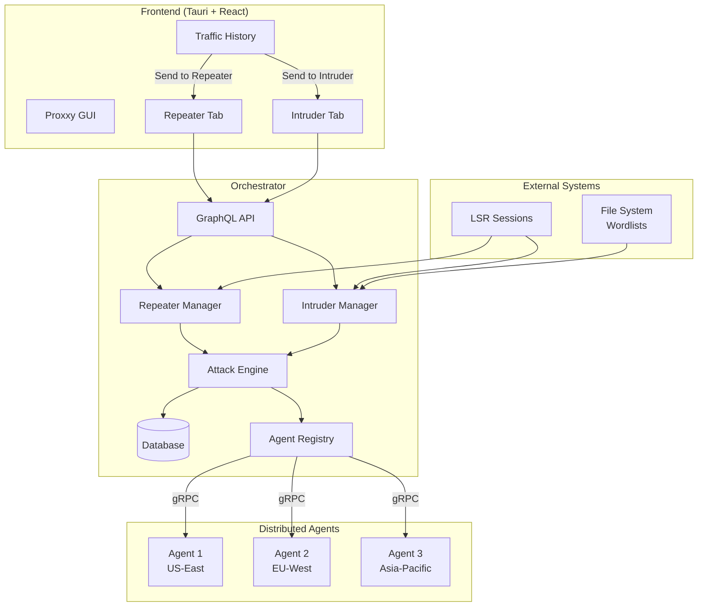

# Design Document: Repeater and Intruder Modules

## Overview

This document outlines the design for implementing Repeater (Manual Request Manipulation) and Intruder (Distributed Fuzzing/Brute-Force) modules within the existing Proxxy distributed MITM proxy architecture. The design leverages the current Orchestrator-Agent infrastructure while introducing new components for offensive security testing capabilities.

The solution provides two key modules:
1. **Repeater Module**: Manual request editing and replay with cross-agent execution
2. **Intruder Module**: Distributed automated fuzzing and brute-force attacks

Both modules integrate seamlessly with existing components including the LSR (Login Sequence Recorder) for session management, the current gRPC protocol for agent communication, and the GraphQL API for frontend integration.

## Architecture

### High-Level Architecture



### Component Responsibilities

#### Attack Engine (Core Component)
- **Payload Distribution**: Implements round-robin and batch distribution strategies
- **Agent Management**: Tracks agent availability and load balancing
- **Execution Coordination**: Manages concurrent request execution across agents
- **Result Aggregation**: Collects and processes results from distributed agents
- **Failure Recovery**: Handles agent failures and payload redistribution

#### Repeater Manager
- **Tab Management**: Maintains independent state for multiple repeater tabs
- **Request Editing**: Handles request modification and validation
- **Agent Selection**: Manages target agent selection and validation
- **History Management**: Stores and retrieves request-response pairs

#### Intruder Manager
- **Attack Configuration**: Manages payload positions, sets, and attack modes
- **Template Management**: Handles attack template creation and reuse
- **Progress Monitoring**: Tracks attack progress and statistics
- **Result Processing**: Handles real-time result streaming and highlighting

## Components and Interfaces

### Database Schema Extensions

#### Repeater Tables

```sql
-- Repeater tabs and configurations
CREATE TABLE IF NOT EXISTS repeater_tabs (
    id TEXT PRIMARY KEY,
    name TEXT NOT NULL,
    request_template TEXT NOT NULL, -- JSON serialized HttpRequestData
    target_agent_id TEXT,
    created_at INTEGER NOT NULL,
    updated_at INTEGER NOT NULL,
    is_active BOOLEAN DEFAULT true,
    FOREIGN KEY(target_agent_id) REFERENCES agents(id)
);

-- Repeater execution history
CREATE TABLE IF NOT EXISTS repeater_history (
    id TEXT PRIMARY KEY,
    tab_id TEXT NOT NULL,
    request_data TEXT NOT NULL, -- JSON serialized HttpRequestData
    response_data TEXT, -- JSON serialized HttpResponseData
    agent_id TEXT NOT NULL,
    executed_at INTEGER NOT NULL,
    duration_ms INTEGER,
    status_code INTEGER,
    FOREIGN KEY(tab_id) REFERENCES repeater_tabs(id),
    FOREIGN KEY(agent_id) REFERENCES agents(id)
);
```

#### Intruder Tables

```sql
-- Intruder attack configurations
CREATE TABLE IF NOT EXISTS intruder_attacks (
    id TEXT PRIMARY KEY,
    name TEXT NOT NULL,
    request_template TEXT NOT NULL, -- JSON with §markers§
    attack_mode TEXT NOT NULL, -- sniper, battering_ram, pitchfork, cluster_bomb
    payload_sets TEXT NOT NULL, -- JSON array of payload configurations
    target_agents TEXT NOT NULL, -- JSON array of agent IDs
    distribution_strategy TEXT NOT NULL, -- round_robin, batch
    created_at INTEGER NOT NULL,
    updated_at INTEGER NOT NULL,
    status TEXT NOT NULL DEFAULT 'configured' -- configured, running, completed, stopped
);

-- Intruder attack results
CREATE TABLE IF NOT EXISTS intruder_results (
    id TEXT PRIMARY KEY,
    attack_id TEXT NOT NULL,
    request_data TEXT NOT NULL, -- JSON serialized request with injected payloads
    response_data TEXT, -- JSON serialized response
    agent_id TEXT NOT NULL,
    payload_values TEXT NOT NULL, -- JSON array of payload values used
    executed_at INTEGER NOT NULL,
    duration_ms INTEGER,
    status_code INTEGER,
    response_length INTEGER,
    is_highlighted BOOLEAN DEFAULT false,
    FOREIGN KEY(attack_id) REFERENCES intruder_attacks(id),
    FOREIGN KEY(agent_id) REFERENCES agents(id)
);

-- Payload sets for reuse
CREATE TABLE IF NOT EXISTS payload_sets (
    id TEXT PRIMARY KEY,
    name TEXT NOT NULL,
    type TEXT NOT NULL, -- wordlist, number_range, custom
    configuration TEXT NOT NULL, -- JSON configuration
    created_at INTEGER NOT NULL
);
```

### Rust Data Models

#### Core Attack Engine Types

```rust
// attack_engine/src/lib.rs
use serde::{Deserialize, Serialize};
use std::collections::HashMap;
use uuid::Uuid;

#[derive(Debug, Clone, Serialize, Deserialize)]
pub struct AttackRequest {
    pub id: String,
    pub request_template: HttpRequestData,
    pub target_agents: Vec<String>,
    pub execution_config: ExecutionConfig,
    pub session_data: Option<SessionData>,
}

#[derive(Debug, Clone, Serialize, Deserialize)]
pub struct ExecutionConfig {
    pub concurrent_requests_per_agent: u32,
    pub timeout_seconds: u64,
    pub retry_attempts: u32,
    pub distribution_strategy: DistributionStrategy,
}

#[derive(Debug, Clone, Serialize, Deserialize)]
pub enum DistributionStrategy {
    RoundRobin,
    Batch { batch_size: usize },
    LoadBalanced,
}

#[derive(Debug, Clone, Serialize, Deserialize)]
pub struct AttackResult {
    pub id: String,
    pub request_id: String,
    pub agent_id: String,
    pub request_data: HttpRequestData,
    pub response_data: Option<HttpResponseData>,
    pub executed_at: chrono::DateTime<chrono::Utc>,
    pub duration_ms: Option<u64>,
    pub error: Option<String>,
}
```

#### Repeater Types

```rust
// repeater/src/models.rs
#[derive(Debug, Clone, Serialize, Deserialize)]
pub struct RepeaterTab {
    pub id: String,
    pub name: String,
    pub request_template: HttpRequestData,
    pub target_agent_id: Option<String>,
    pub created_at: chrono::DateTime<chrono::Utc>,
    pub updated_at: chrono::DateTime<chrono::Utc>,
    pub is_active: bool,
}

#[derive(Debug, Clone, Serialize, Deserialize)]
pub struct RepeaterExecution {
    pub id: String,
    pub tab_id: String,
    pub request_data: HttpRequestData,
    pub response_data: Option<HttpResponseData>,
    pub agent_id: String,
    pub executed_at: chrono::DateTime<chrono::Utc>,
    pub duration_ms: Option<u64>,
    pub status_code: Option<i32>,
}

#[derive(Debug, Clone, Serialize, Deserialize)]
pub struct RepeaterRequest {
    pub tab_id: String,
    pub request_data: HttpRequestData,
    pub target_agent_id: String,
    pub session_data: Option<SessionData>,
}
```

#### Intruder Types

```rust
// intruder/src/models.rs
#[derive(Debug, Clone, Serialize, Deserialize)]
pub struct IntruderAttack {
    pub id: String,
    pub name: String,
    pub request_template: String, // Raw template with §markers§
    pub attack_mode: AttackMode,
    pub payload_sets: Vec<PayloadSet>,
    pub target_agents: Vec<String>,
    pub distribution_strategy: DistributionStrategy,
    pub created_at: chrono::DateTime<chrono::Utc>,
    pub status: AttackStatus,
}

#[derive(Debug, Clone, Serialize, Deserialize)]
pub enum AttackMode {
    Sniper,      // Single payload position, iterate through all payloads
    BatteringRam, // Multiple positions, same payload in all
    Pitchfork,   // Multiple positions, parallel iteration
    ClusterBomb, // Multiple positions, all combinations
}

#[derive(Debug, Clone, Serialize, Deserialize)]
pub enum AttackStatus {
    Configured,
    Running,
    Completed,
    Stopped,
    Failed,
}

#[derive(Debug, Clone, Serialize, Deserialize)]
pub struct PayloadSet {
    pub id: String,
    pub name: String,
    pub payload_type: PayloadType,
    pub configuration: PayloadConfig,
}

#[derive(Debug, Clone, Serialize, Deserialize)]
pub enum PayloadType {
    Wordlist,
    NumberRange,
    Custom,
}

#[derive(Debug, Clone, Serialize, Deserialize)]
pub enum PayloadConfig {
    Wordlist { file_path: String, encoding: String },
    NumberRange { start: i64, end: i64, step: i64, format: String },
    Custom { values: Vec<String> },
}

#[derive(Debug, Clone, Serialize, Deserialize)]
pub struct PayloadPosition {
    pub start: usize,
    pub end: usize,
    pub payload_set_id: String,
}
```

### gRPC Protocol Extensions

```protobuf
// proto/proxy.proto extensions
message RepeaterRequest {
  string request_id = 1;
  HttpRequestData request = 2;
  string session_id = 3;
  map<string, string> session_headers = 4;
}

message IntruderRequest {
  string attack_id = 1;
  string request_id = 2;
  HttpRequestData request = 3;
  repeated string payload_values = 4;
  string session_id = 5;
  map<string, string> session_headers = 6;
}

message AttackCommand {
  oneof command {
    RepeaterRequest repeater_request = 1;
    IntruderRequest intruder_request = 2;
    bool stop_attack = 3;
  }
}

// Extend existing InterceptCommand
message InterceptCommand {
  oneof command {
    bool drop = 1;
    bool modify = 2;
    ExecuteRequest execute = 3;
    AttackCommand attack = 4; // NEW
  }
}
```

## Data Models

### Session Integration

The system integrates with LSR (Login Sequence Recorder) sessions through a standardized session interface:

```rust
#[derive(Debug, Clone, Serialize, Deserialize)]
pub struct SessionData {
    pub id: String,
    pub name: String,
    pub headers: HashMap<String, String>,
    pub cookies: HashMap<String, String>,
    pub created_at: chrono::DateTime<chrono::Utc>,
    pub expires_at: Option<chrono::DateTime<chrono::Utc>>,
}

impl SessionData {
    pub fn apply_to_request(&self, request: &mut HttpRequestData) {
        // Inject session headers and cookies into request
        if let Some(headers) = &mut request.headers {
            for (key, value) in &self.headers {
                headers.headers.insert(key.clone(), value.clone());
            }
        }
        
        // Handle cookie merging
        self.merge_cookies(request);
    }
    
    fn merge_cookies(&self, request: &mut HttpRequestData) {
        // Implementation for cookie merging logic
    }
}
```

### Payload Generation

```rust
pub trait PayloadGenerator {
    fn generate(&self) -> Result<Vec<String>, PayloadError>;
    fn count(&self) -> Result<usize, PayloadError>;
}

pub struct WordlistGenerator {
    file_path: String,
    encoding: String,
}

impl PayloadGenerator for WordlistGenerator {
    fn generate(&self) -> Result<Vec<String>, PayloadError> {
        // Read and parse wordlist file
        std::fs::read_to_string(&self.file_path)?
            .lines()
            .map(|line| line.trim().to_string())
            .filter(|line| !line.is_empty())
            .collect()
    }
    
    fn count(&self) -> Result<usize, PayloadError> {
        // Efficient line counting without loading entire file
        Ok(std::fs::read_to_string(&self.file_path)?
            .lines()
            .filter(|line| !line.trim().is_empty())
            .count())
    }
}

pub struct NumberRangeGenerator {
    start: i64,
    end: i64,
    step: i64,
    format: String,
}

impl PayloadGenerator for NumberRangeGenerator {
    fn generate(&self) -> Result<Vec<String>, PayloadError> {
        let mut payloads = Vec::new();
        let mut current = self.start;
        
        while current <= self.end {
            payloads.push(format!(&self.format, current));
            current += self.step;
        }
        
        Ok(payloads)
    }
    
    fn count(&self) -> Result<usize, PayloadError> {
        Ok(((self.end - self.start) / self.step + 1) as usize)
    }
}
```

## Correctness Properties

*A property is a characteristic or behavior that should hold true across all valid executions of a system-essentially, a formal statement about what the system should do. Properties serve as the bridge between human-readable specifications and machine-verifiable correctness guarantees.*

### Property Reflection

After analyzing all acceptance criteria, I identified several areas where properties can be consolidated:

- **Request handling properties** (1.1, 1.4, 1.5) can be combined into comprehensive request processing properties
- **Agent management properties** (2.1, 2.2, 2.3, 2.4, 2.5) can be consolidated into agent interaction properties  
- **Attack configuration properties** (3.1, 3.2, 3.3, 3.4) can be combined into attack setup properties
- **Payload distribution properties** (3.5, 4.4, 4.5) can be unified into distribution algorithm properties
- **Session integration properties** (6.1, 6.2, 6.3) can be combined into session handling properties
- **Data persistence properties** (7.1, 7.2, 7.3, 7.4, 7.5) can be consolidated into persistence properties

This consolidation eliminates redundancy while ensuring comprehensive coverage of all requirements.

### Core Properties

**Property 1: Request Processing Integrity**
*For any* HTTP request sent through repeater or intruder, the system should preserve request structure while applying modifications and capture complete response data including headers, body, status code, and timing information.
**Validates: Requirements 1.1, 1.2, 1.4, 1.5**

**Property 2: Agent Selection and Routing**
*For any* agent selection operation, the system should validate agent availability, route requests through selected agents, include agent identification in responses, and handle agent failures gracefully.
**Validates: Requirements 2.1, 2.2, 2.3, 2.4, 2.5**

**Property 3: Attack Configuration Validation**
*For any* intruder attack configuration, the system should validate payload position syntax, support multiple payload types, validate agent selection, and create proper attack templates.
**Validates: Requirements 3.1, 3.2, 3.3, 3.4**

**Property 4: Payload Distribution Algorithms**
*For any* payload distribution across multiple agents, the system should implement the specified distribution strategy (round-robin or batch), handle agent failures by redistributing payloads, and maintain load balance across available agents.
**Validates: Requirements 3.5, 4.4, 4.5**

**Property 5: Payload Generation Consistency**
*For any* payload configuration (wordlist, number range, or custom), the system should generate payloads within specified bounds, validate file formats, and support different attack modes with correct payload combinations.
**Validates: Requirements 4.1, 4.2, 4.3**

**Property 6: Real-time Monitoring Accuracy**
*For any* running attack, the system should display accurate real-time progress, update results immediately upon receipt, handle graceful termination, and highlight interesting responses based on configured criteria.
**Validates: Requirements 5.1, 5.2, 5.3, 5.4, 5.5**

**Property 7: Session Integration Completeness**
*For any* session data application, the system should inject all session headers and cookies, apply session data to all attack requests, preserve original authentication while allowing modifications, and handle session expiration appropriately.
**Validates: Requirements 6.1, 6.2, 6.3, 6.4, 6.5**

**Property 8: Data Persistence Consistency**
*For any* repeater or intruder operation, the system should persist configurations, store execution results with complete metadata, save templates for reuse, and restore data correctly after application restart.
**Validates: Requirements 7.1, 7.2, 7.3, 7.4, 7.5**

**Property 9: Performance and Concurrency Management**
*For any* high-load scenario, the system should limit concurrent requests per agent, implement backpressure mechanisms, adjust load distribution dynamically, manage memory usage efficiently, and implement retry logic with exponential backoff.
**Validates: Requirements 8.1, 8.2, 8.3, 8.4, 8.5**

**Property 10: Security and Error Handling**
*For any* sensitive data handling or error condition, the system should mask sensitive values in logs and UI, provide detailed error messages with remediation suggestions, detect failures quickly, validate inputs properly, and degrade gracefully under resource exhaustion.
**Validates: Requirements 9.1, 9.2, 9.3, 9.4, 9.5**

**Property 11: Architecture Integration Compliance**
*For any* system integration point, the system should provide appropriate UI options for traffic actions, route requests through existing agent infrastructure, store data using existing database schemas, follow existing design patterns, and extend existing protocols rather than creating new ones.
**Validates: Requirements 10.1, 10.2, 10.3, 10.4, 10.5**

## Error Handling

### Error Types and Recovery Strategies

```rust
#[derive(Debug, thiserror::Error)]
pub enum AttackError {
    #[error("Agent not available: {agent_id}")]
    AgentUnavailable { agent_id: String },
    
    #[error("Invalid payload configuration: {reason}")]
    InvalidPayloadConfig { reason: String },
    
    #[error("Request execution failed: {error}")]
    ExecutionFailed { error: String },
    
    #[error("Session expired: {session_id}")]
    SessionExpired { session_id: String },
    
    #[error("Payload generation failed: {reason}")]
    PayloadGenerationFailed { reason: String },
    
    #[error("Database operation failed: {operation}")]
    DatabaseError { operation: String },
    
    #[error("Network error: {details}")]
    NetworkError { details: String },
}

pub struct ErrorRecoveryStrategy {
    pub max_retries: u32,
    pub backoff_strategy: BackoffStrategy,
    pub fallback_agents: Vec<String>,
}

#[derive(Debug, Clone)]
pub enum BackoffStrategy {
    Fixed { delay_ms: u64 },
    Exponential { initial_delay_ms: u64, multiplier: f64, max_delay_ms: u64 },
    Linear { initial_delay_ms: u64, increment_ms: u64 },
}
```

### Graceful Degradation

The system implements graceful degradation strategies:

1. **Agent Failure**: Redistribute payloads to remaining agents
2. **Memory Pressure**: Stream results to disk and implement cleanup
3. **Network Issues**: Implement retry with exponential backoff
4. **Session Expiration**: Provide refresh options and continue with available data
5. **Resource Exhaustion**: Reduce concurrency and queue requests

## Testing Strategy

### Dual Testing Approach

The testing strategy employs both unit tests and property-based tests to ensure comprehensive coverage:

**Unit Tests**: Focus on specific examples, edge cases, and integration points
- Repeater tab creation and management
- Payload generation algorithms
- Agent selection logic
- Session data injection
- Database operations
- Error handling scenarios

**Property Tests**: Verify universal properties across all inputs
- Request processing integrity across all request types
- Agent routing consistency across all agent configurations
- Payload distribution fairness across all distribution strategies
- Session integration completeness across all session types
- Data persistence consistency across all operation types

### Property-Based Testing Configuration

- **Minimum 100 iterations** per property test to ensure comprehensive input coverage
- **Test tags** reference design document properties: `Feature: repeater-intruder, Property {number}: {property_text}`
- **Input generators** create realistic test data including valid HTTP requests, agent configurations, payload sets, and session data
- **Failure analysis** includes counterexample investigation and root cause analysis

### Integration Testing

- **End-to-end workflows**: Complete repeater and intruder workflows from GUI to agent execution
- **Cross-component integration**: Database, gRPC, GraphQL, and GUI integration
- **Performance testing**: Load testing with multiple concurrent attacks and agents
- **Failure simulation**: Agent failures, network issues, and resource exhaustion scenarios

### Mock Infrastructure

- **Mock agents** for testing distribution algorithms and failure scenarios
- **Mock sessions** for testing authentication integration
- **Mock file system** for testing wordlist and configuration persistence
- **Mock network** for testing error handling and retry logic

The testing strategy ensures that both individual components work correctly (unit tests) and that the system as a whole maintains its correctness properties under all conditions (property tests).