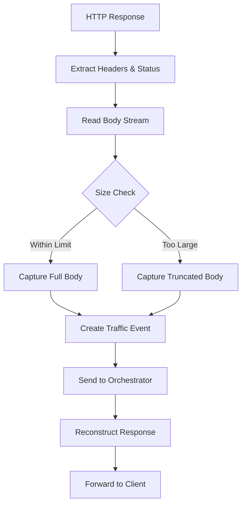

# Design Document

## Overview

This design addresses the critical issue where HTTP response bodies are not being captured by the Proxxy proxy-core, resulting in empty response bodies in traffic logs. The solution involves modifying the `handle_response` method in `proxy-core/src/handlers.rs` to properly read, capture, and reconstruct HTTP response bodies while maintaining proxy functionality.

## Architecture

The response body capture system will be implemented as an enhancement to the existing `LogHandler` in the proxy-core. The architecture follows a stream-processing pattern where response bodies are read, stored, and then reconstructed for client delivery.

### Key Components

1. **Response Body Reader**: Consumes the HTTP response body stream
2. **Body Storage**: Temporarily holds body data for logging
3. **Response Reconstructor**: Creates a new response with the captured body
4. **Memory Manager**: Controls memory usage and implements size limits
5. **Error Handler**: Manages failures gracefully

## Components and Interfaces

### LogHandler Enhancement

The existing `LogHandler` struct will be enhanced with response body capture capabilities:

```rust
pub struct LogHandler {
    metrics: Arc<Metrics>,
    log_sender: Option<tokio::sync::mpsc::Sender<crate::pb::TrafficEvent>>,
    scope_matcher: Option<Arc<crate::filter::ScopeMatcher>>,
    current_request_id: Arc<RwLock<Option<String>>>,
    // New fields for response body capture
    max_body_size: usize,
    capture_enabled: bool,
}
```

### Response Body Processing Pipeline



### Body Reading Strategy

The response body will be read using Hyper's body utilities with timeout handling:

```rust
use hyper::body::{Bytes, HttpBody};
use tokio_stream::StreamExt;
use tokio::time::{timeout, Duration};

async fn read_response_body(
    body: Body, 
    max_size: usize,
    response_timeout: Duration,
    stream_timeout: Duration,
) -> Result<Vec<u8>, BodyReadError> {
    let mut body_data = Vec::new();
    let mut body_stream = body;
    
    // Apply overall response timeout
    let read_result = timeout(response_timeout, async {
        while let Some(chunk_result) = body_stream.data().await {
            // Apply per-chunk timeout
            let chunk = timeout(stream_timeout, async { chunk_result }).await??;
            
            if body_data.len() + chunk.len() > max_size {
                // Truncate and mark as truncated
                let remaining = max_size - body_data.len();
                body_data.extend_from_slice(&chunk[..remaining]);
                break;
            }
            body_data.extend_from_slice(&chunk);
        }
        Ok(body_data)
    }).await;
    
    match read_result {
        Ok(Ok(data)) => Ok(data),
        Ok(Err(e)) => Err(BodyReadError::StreamError(e)),
        Err(_) => Err(BodyReadError::TimeoutError),
    }
}
```

## Data Models

### Enhanced HttpResponseData

The existing `HttpResponseData` protobuf message already supports body storage:

```protobuf
message HttpResponseData {
    int32 status_code = 1;
    HttpHeaders headers = 2;
    bytes body = 3;  // This field exists but is currently unused
    TlsDetails tls = 4;
}
```

### Body Capture Configuration

```rust
pub struct BodyCaptureConfig {
    pub enabled: bool,
    pub max_body_size: usize,
    pub truncate_threshold: usize,
    pub memory_limit: usize,
    pub content_type_filters: Vec<String>,
    pub response_timeout: Duration,
    pub stream_read_timeout: Duration,
}

impl Default for BodyCaptureConfig {
    fn default() -> Self {
        Self {
            enabled: true,
            max_body_size: 10 * 1024 * 1024, // 10MB
            truncate_threshold: 1024 * 1024,  // 1MB
            memory_limit: 50 * 1024 * 1024,   // 50MB total
            content_type_filters: vec![],
            response_timeout: Duration::from_secs(30),    // 30 seconds total response timeout
            stream_read_timeout: Duration::from_secs(5),  // 5 seconds per chunk read timeout
        }
    }
}
```

## Correctness Properties

*A property is a characteristic or behavior that should hold true across all valid executions of a system-essentially, a formal statement about what the system should do. Properties serve as the bridge between human-readable specifications and machine-verifiable correctness guarantees.*

### Property Reflection

After analyzing all acceptance criteria, several properties can be consolidated to eliminate redundancy:

- Properties 1.2 and 4.5 both test data storage correctness and can be combined
- Properties 1.3 and 2.2 both test round-trip integrity and can be combined  
- Properties 3.3 and 4.2 both test binary data integrity and can be combined
- Properties 4.1, 4.3, and 4.4 all test text/encoding preservation and can be combined

### Core Properties

**Property 1: Response body round-trip integrity**
*For any* HTTP response with a body, after the proxy captures the body for logging and reconstructs the response, the client should receive byte-identical data to the original response
**Validates: Requirements 1.3, 2.2**

**Property 2: Complete body capture**
*For any* HTTP response within size limits, the captured body in the Traffic_Event should be identical to the original response body
**Validates: Requirements 1.1, 1.2**

**Property 3: Size limit enforcement**
*For any* HTTP response body larger than the configured limit, the captured body should be truncated to the limit size and marked with a truncation indicator
**Validates: Requirements 1.4, 3.1**

**Property 4: Stream consumption completeness**
*For any* HTTP response body stream, the Log_Handler should consume the entire stream before reconstructing the response
**Validates: Requirements 2.1**

**Property 5: Binary data integrity**
*For any* HTTP response containing binary data, the captured body should maintain exact byte sequences without corruption
**Validates: Requirements 3.3, 4.2**

**Property 6: Text and encoding preservation**
*For any* HTTP response containing text with specific character encoding, the captured body should preserve the exact byte sequences and encoding
**Validates: Requirements 4.1, 4.3, 4.4**

**Property 7: Error isolation**
*For any* failure during response body capture, the client response should be unaffected and the proxy should continue functioning
**Validates: Requirements 5.1, 5.2, 5.3, 5.4, 5.5**

**Property 8: Configuration compliance**
*For any* configuration setting (enabled/disabled, size limits, content-type filters), the Log_Handler should behave according to the configured values
**Validates: Requirements 7.1, 7.2, 7.3, 7.4, 7.5**

**Property 9: Memory limit enforcement**
*For any* concurrent response processing scenario, the total memory usage for body capture should not exceed configured limits
**Validates: Requirements 3.2, 7.5**

**Property 10: Chunked encoding handling**
*For any* HTTP response using chunked transfer encoding, the complete decoded body should be captured correctly
**Validates: Requirements 2.3**

**Property 11: Compressed data preservation**
*For any* HTTP response with compressed content, the raw compressed data should be captured without decompression
**Validates: Requirements 2.4**

**Property 12: Performance impact when disabled**
*For any* HTTP response when body capture is disabled, there should be no measurable performance impact compared to no logging
**Validates: Requirements 6.5**

**Property 13: Timeout handling**
*For any* HTTP response that takes longer than the configured timeout to read, the Log_Handler should capture partial data and continue without blocking the proxy
**Validates: Requirements 8.1, 8.2, 8.3, 8.4**

<function_calls>
<invoke name="prework">
<parameter name="featureName">response-body-capture

## Error Handling

### Error Categories

1. **Stream Reading Errors**: Network timeouts, connection drops, malformed data
2. **Memory Allocation Errors**: Out of memory conditions during body capture
3. **Database Storage Errors**: Failures when persisting captured data
4. **Configuration Errors**: Invalid settings or missing configuration

### Error Handling Strategy

```rust
pub enum BodyCaptureError {
    StreamReadError(String),
    MemoryAllocationError,
    DatabaseStorageError(String),
    ConfigurationError(String),
    SizeLimitExceeded(usize),
    TimeoutError,
    StreamTimeoutError,
}

impl BodyCaptureError {
    pub fn should_continue_proxy(&self) -> bool {
        // All errors should allow proxy to continue
        true
    }
    
    pub fn fallback_body(&self) -> Vec<u8> {
        // Return empty body on any error
        Vec::new()
    }
}
```

### Graceful Degradation

- **Capture Failure**: Continue with empty body logging
- **Memory Pressure**: Reduce capture size limits dynamically
- **Storage Failure**: Log error but don't block response forwarding
- **Configuration Error**: Use safe defaults
- **Response Timeout**: Capture partial body and continue with truncated data
- **Stream Timeout**: Log timeout error and continue with empty body

## Testing Strategy

### Unit Testing Approach

Unit tests will focus on specific components and error conditions:

- Response body reading with various content types
- Memory limit enforcement
- Error handling scenarios
- Configuration validation

### Property-Based Testing Approach

Property-based tests will validate universal behaviors across many inputs:

- Generate random HTTP responses with various body sizes and types
- Test round-trip integrity with different encoding scenarios
- Verify size limit enforcement with randomly sized bodies
- Test concurrent processing with multiple simultaneous responses

Each property test will run a minimum of 100 iterations to ensure comprehensive coverage through randomization.

### Test Configuration

Property tests will be tagged with references to design properties:

```rust
#[cfg(test)]
mod tests {
    use proptest::prelude::*;
    
    #[test]
    fn test_response_body_round_trip_integrity() {
        // Feature: response-body-capture, Property 1: Response body round-trip integrity
        // Test implementation here
    }
}
```

### Integration Testing

Integration tests will verify end-to-end functionality:

- Full proxy request/response cycles with body capture
- Database storage and retrieval verification
- GraphQL API response body access
- Performance impact measurement

## Implementation Notes

### Hyper Body Handling

The implementation will use Hyper's body utilities for efficient stream processing:

```rust
use hyper::body::{Bytes, HttpBody, Body};
use hyper::Response;

async fn capture_and_reconstruct_response(
    response: Response<Body>,
    config: &BodyCaptureConfig,
) -> (Response<Body>, Vec<u8>) {
    let (parts, body) = response.into_parts();
    let captured_body = read_body_with_limits(body, config).await;
    let new_body = Body::from(captured_body.clone());
    let new_response = Response::from_parts(parts, new_body);
    (new_response, captured_body)
}
```

### Memory Management

- Use streaming techniques to avoid loading entire bodies into memory
- Implement configurable size limits with truncation
- Monitor memory usage during concurrent processing
- Implement backpressure mechanisms for high-volume scenarios

### Database Considerations

- Store response bodies as BLOB data in SQLite
- Consider compression for large bodies
- Implement cleanup policies for old data
- Handle database connection failures gracefully