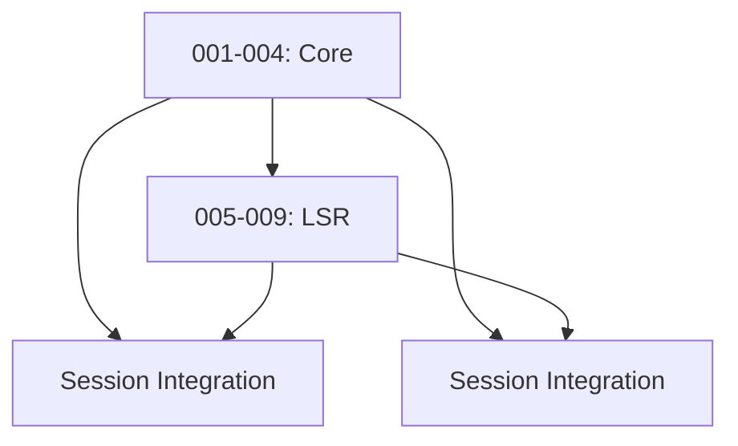

# Database Migration Coordination

This document coordinates database migrations across all Proxxy modules to prevent conflicts and ensure proper ordering.

## Migration Number Ranges

To prevent migration number collisions, each module has reserved ranges:

| Module | Range | Files | Status |
|--------|-------|-------|--------|
| **Core** | 001-004 | Existing migrations | ✅ Implemented |
| **LSR** | 005-009 | Login profiles, executions | 📝 LSR_TASKS.md |
| **Repeater/Intruder** | 010-014 | Attack tables, results | 📝 Repeater/Intruder spec |
| **Nuclei** | 015-019 | Scan results (if needed) | 📝 NUCLEI_TASKS.md |
| **Future Modules** | 020+ | Reserved for expansion | 🔮 Future |

## Current Migration Files

### Core Migrations (001-004)
- `001_initial_schema.sql` - Basic tables
- `002_add_agents.sql` - Agent management
- `003_add_traffic.sql` - Traffic capture
- `004_add_sessions.sql` - Basic session support

### LSR Migrations (005-009)
- `005_add_login_profiles.sql` - Login profile storage
- `006_add_profile_executions.sql` - Execution tracking
- `007-009` - Reserved for LSR expansion

### Repeater/Intruder Migrations (010-014)
- `010_add_repeater_tables.sql` - Repeater tabs and history
- `011_add_intruder_tables.sql` - Attack configurations and results
- `012_add_payload_sets.sql` - Reusable payload configurations
- `013-014` - Reserved for attack module expansion

### Nuclei Migrations (015-019)
- `015_add_nuclei_scans.sql` - Scan configurations (if needed)
- `016-019` - Reserved for Nuclei expansion

## Migration Dependencies



## Rules

1. **Sequential Numbering**: Migrations must be numbered sequentially within each range
2. **No Gaps**: Don't skip numbers within a range
3. **Cross-Module Dependencies**: If Module B depends on Module A tables, Module A migrations must run first
4. **Rollback Support**: All migrations must include DOWN migrations for rollback
5. **Testing**: Test migrations on clean database and with existing data

## Session Table Integration

The core `sessions` table (from migration 004) provides the foundation for all session-related functionality:

```sql
-- Core sessions table (004_add_sessions.sql)
CREATE TABLE IF NOT EXISTS sessions (
    id TEXT PRIMARY KEY,
    name TEXT NOT NULL,
    headers TEXT NOT NULL, -- JSON
    cookies TEXT NOT NULL, -- JSON
    created_at INTEGER NOT NULL,
    expires_at INTEGER,
    profile_id TEXT, -- References login_profiles(id)
    status TEXT NOT NULL DEFAULT 'validating',
    metadata TEXT -- JSON
);
```

## Coordination Checklist

Before implementing migrations:

- [ ] Check this file for your assigned range
- [ ] Verify no conflicts with other modules
- [ ] Update this file with your planned migrations
- [ ] Test migrations in isolation
- [ ] Test migrations with other modules
- [ ] Document any cross-module dependencies

## Emergency Procedures

If migration conflicts occur:

1. **Stop Development**: Don't proceed with conflicting migrations
2. **Coordinate**: Discuss with other module developers
3. **Reassign Numbers**: Update this file with new assignments
4. **Update Code**: Change migration file names and references
5. **Test**: Verify no conflicts remain

## Contact

For migration coordination questions:
- Create an issue in the main repository
- Tag relevant module developers
- Reference this document in discussions

---

*Last Updated: 2024-01-12*
*Next Review: When new modules are added*